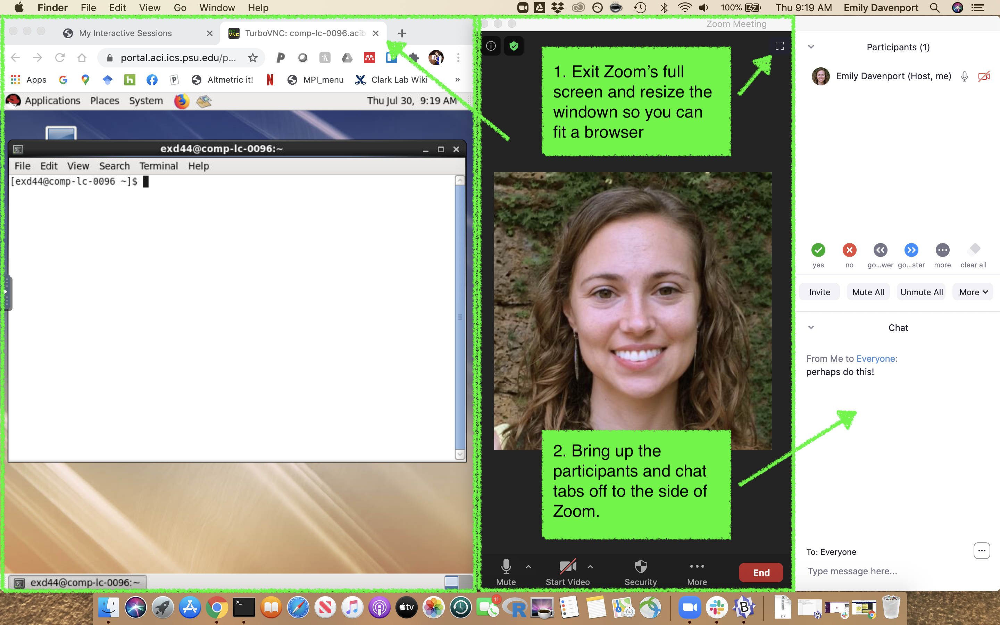
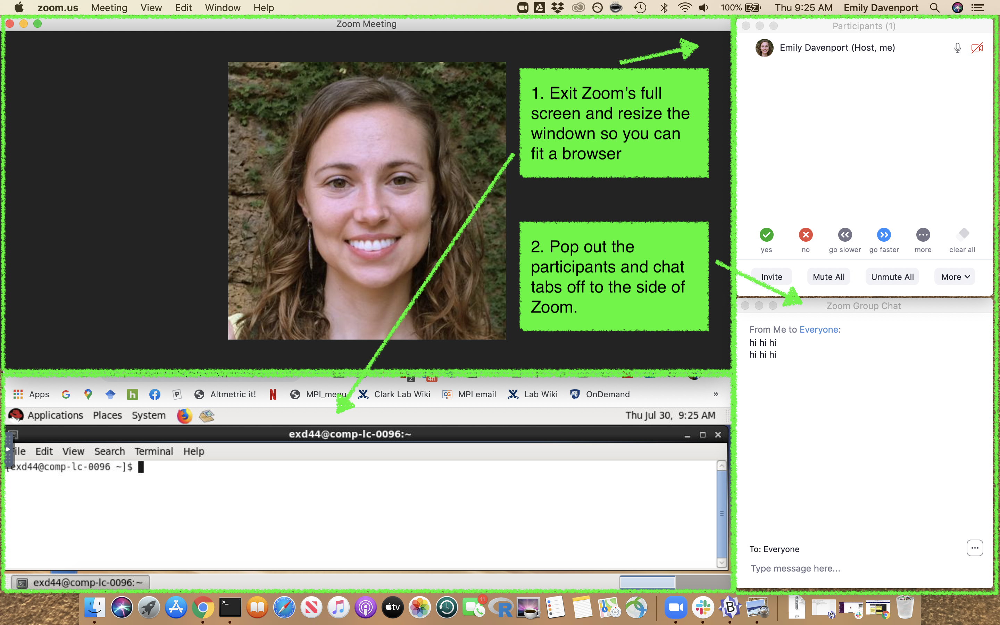

# Intro to Unix and Programming

## Goals
1. Gain familiarity with Penn State's [ICDS-ACI computing cluster](https://www.icds.psu.edu/computing-services/icds-aci-user-guide/) cluster.  

2. Learn how to control a computer via command line, including:
	- moving around the computer 
	- making, moving, and deleting files
	- combining commands 
3. Learn basics of programming in R, including:
	- getting data into R
	- understanding different data types
	- manipulating, analyzing, and exporting data
	- visualizing data

## Resources
- [ICDS-ACI Users' Guide](https://www.icds.psu.edu/computing-services/icds-aci-user-guide/)
- [ICDS-ACI OnDemand Portal](portal.aci.ics.psu.edu)
- [Workshop schedule](https://docs.google.com/document/d/1fqNPD71YPvxirEdxWATuMLxlCjNNrXrDJ5wJeqj7hkw/edit)

## Schedule
 10am - 12pm: [Software Carpentry - The Unix Shell](https://swcarpentry.github.io/shell-novice/)  
 12pm - 1pm: Lunch!  
 1pm - 4pm: [Data Carpentry - Data Analysis and Visualization in R for Ecologists](https://datacarpentry.org/R-ecology-lesson/index.html) 
 
## Configuration Suggestions
1. Two monitors: Set up Zoom on one and browser on the other.

2. Two devices: Code in your browser on your computer, and call into Zoom on your tablet, iPhone, etc. You may want to also call in from the computer you're coding on so that you can cut and paste any commands entered in the Zoom chat. 
3. One device - Option 1: Set up your browser and Zoom side by side, so that you can watch the presentation and code at the same time.

4. One device - Option 2: Set up your browser and Zoom on top of each other, so that you can watch the presentation and code at the same time. 

 