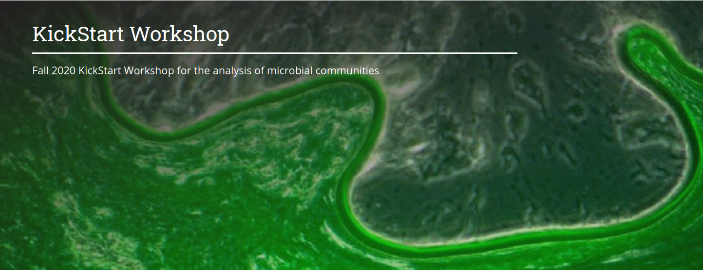

# KickStart-Workshop-2020
Materials for the Fall 2020 KickStart Workshop

## Requirements
A PSU email and access to Penn State’s ACI-ICS system is required prior to the workshop. You can do this by going to https://accounts.aci.ics.psu.edu, and entering your information.  For the purposes of this workshop, please list Laura Weyrich (lsw132) as your account sponsor and put "2020 Microbiome Center Summer Workshop" into the "Research Description" field of the account request form. 

## Schedule

- Day 0: (OPTIONAL) [Unix Basics and Intro to Programming](/Day0-UnixBasics) -- Emily Davenport
- Day 1: [Basics of Microbiome Analysis - From Planning to Sequencing](/Day1-MicrobiomeAnalysisBasics) -- All Tutors
- Day 2: Amplicon Analysis Workshop -- Sharifa Crandall
- Day 3: Whole Genome Shotgun Analysis Workshop -- Laura Weyrich
- Day 4: Introduction to PSU Microbiome Center -- Darrel Cockburn (with Guests!)

